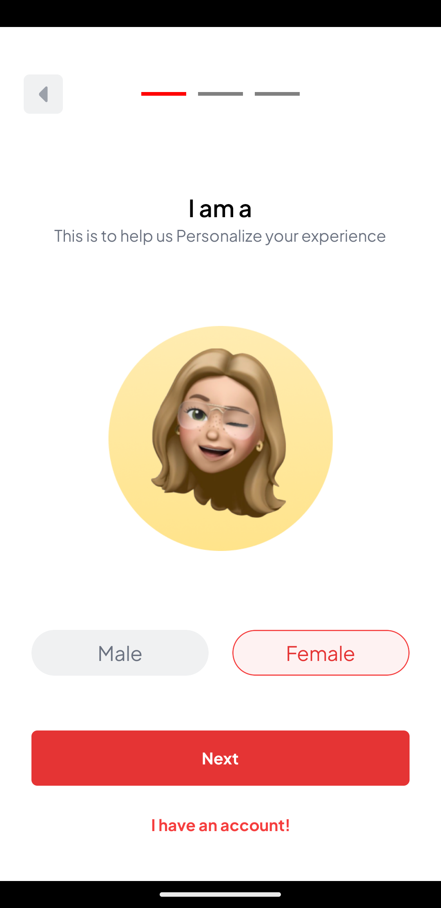
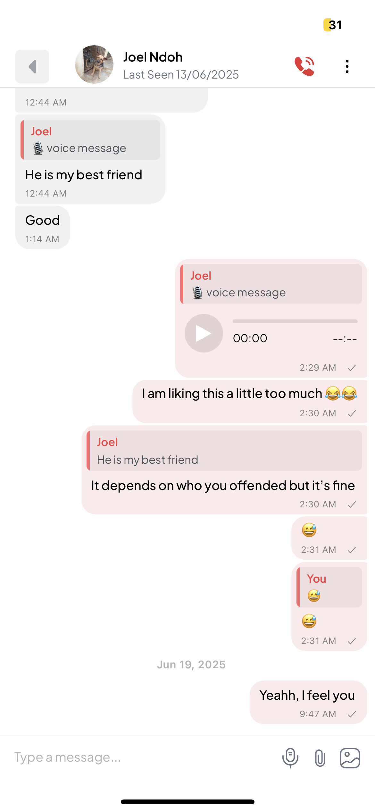

# VarcityChat

VarcityChat is a social platform designed to connect students from different universities, fostering communication and community through a robust chat system. The app features a seamless signup and registration process and a sophisticated chat section inspired by WhatsApp, enabling real-time messaging between users.

## Table of Contents

- [Features](#features)
- [Tech Stack](#tech-stack)
- [Architecture](#architecture)
- [Installation](#installation)
- [Usage](#usage)
- [Screenshots](#screenshots)
- [License](#license)

## Features

- **User Registration and Authentication**: Secure signup and login for students using email and password.
- **Real-Time Chat**: WhatsApp-like chat functionality with real-time messaging, typing indicators, and read receipts.
- **University-Based Communities**: Connects students from various universities, allowing them to join groups or direct message peers.
- **Scalable Messaging Queue**: Handles high message throughput with Redis and BullMQ for asynchronous processing.
- **Cross-Platform**: Built with React Native for a consistent experience on iOS and Android.

## Tech Stack

- **Frontend**: React Native, TypeScript
- **Backend**: Node.js, TypeScript
- **Database**: Redis for caching and session management
- **Queue Management**: BullMQ for handling asynchronous tasks like message delivery
- **Deployment**: Render for hosting and scaling
- **Other Tools**: WebSocket for real-time communication, JWT for authentication

## Architecture

VarcityChat follows a client-server architecture:

- **Client**: React Native app handles the user interface, including signup forms and chat screens, communicating with the backend via REST APIs and WebSockets.
- **Server**: Node.js backend manages user authentication, message routing, and group management. Redis stores session data and caches frequently accessed information.
- **Queue**: BullMQ processes tasks like sending messages or notifications asynchronously to ensure scalability.
- **Real-Time Communication**: WebSocket enables instant messaging with low latency.

## Installation

To run VarcityChat locally, follow these steps:

### Prerequisites

- Node.js (v16 or higher)
- Redis (v6 or higher)
- Yarn or npm
- React Native environment setup (for mobile development)

### Steps

1. **Clone the repository**:

   ```bash
   git clone https://github.com/your-username/varcitychat.git
   cd varcitychat
   ```

2. **Install backend dependencies**:

   ```bash
   cd backend
   yarn install
   ```

3. **Install frontend dependencies**:

   ```bash
   cd ../frontend
   yarn install
   ```

4. **Set up environment variables**:
   Create a `.env` file in the `backend` directory with the following:

   ```env
   REDIS_URL=redis://localhost:6379
   JWT_SECRET=your_jwt_secret
   PORT=3000
   ```

5. **Start Redis**:
   Ensure Redis is running locally or provide a remote Redis URL in the `.env` file.

6. **Run the backend**:

   ```bash
   cd backend
   yarn start
   ```

7. **Run the frontend**:
   ```bash
   cd frontend
   yarn start
   ```
   Follow React Native instructions to run the app on a simulator or physical device.

## Usage

1. **Signup**: Open the app, navigate to the signup section, and register with your university email.
2. **Chat**: After logging in, browse university groups or start a direct chat with another student.
3. **Real-Time Messaging**: Send and receive messages instantly, with support for typing indicators and read receipts.

## Screenshots

Below are some screenshots showcasing VarcityChat's key features:

### Signup Screen

<!--  -->

_Description_: The signup screen allows students to register with their university email and create a profile.

### Chat Interface

<!--  -->

_Description_: The WhatsApp-inspired chat interface supports real-time messaging with typing indicators and read receipts.

## License

This project is licensed under the MIT License. See the [LICENSE](LICENSE) file for details.
